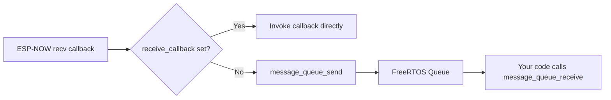

The message queue provides a thread-safe buffer for received messages when no custom callback is set.

## Overview



## API

### `message_queue_init`

Create the FreeRTOS message queue. Safe to call multiple times (no-op if already initialized).

```c
esp_err_t message_queue_init(void);
```

**Returns:** `ESP_OK` on success, `ESP_FAIL` if queue creation fails.

### `message_queue_deinit`

Delete the message queue and free resources.

```c
esp_err_t message_queue_deinit(void);
```

**Returns:** `ESP_OK`.

### `message_queue_get_handle`

Get the underlying FreeRTOS queue handle for direct access.

```c
QueueHandle_t message_queue_get_handle(void);
```

**Returns:** Queue handle, or NULL if not initialized.

### `message_queue_send`

Enqueue a received message. Called internally by the receive handler.

```c
esp_err_t message_queue_send(const message_t *msg);
```

| Parameter | Type | Description |
| :-------- | :--- | :---------- |
| `msg` | `const message_t*` | Message to enqueue |

**Returns:** `ESP_OK` on success, `ESP_FAIL` if queue is full or not initialized.

### `message_queue_receive`

Dequeue a message. Blocks for up to `timeout` ticks.

```c
esp_err_t message_queue_receive(message_t *msg, TickType_t timeout);
```

| Parameter | Type | Description |
| :-------- | :--- | :---------- |
| `msg` | `message_t*` | Output buffer for the received message |
| `timeout` | `TickType_t` | Maximum wait time in FreeRTOS ticks |

**Returns:** `ESP_OK` if a message was received, `ESP_FAIL` on timeout or error.

## Types

### `message_t`

```c
typedef struct {
    char message[256];
    uint8_t sender_mac[6];
    uint32_t timestamp;
    uint8_t type;
    uint8_t group_id;
    uint8_t target_mac[6];
} message_t;
```

::: callout info title:"Buffer Size"
The `message` field in `message_t` is 256 bytes, larger than the 128-byte payload in `mesh_message_t`. This provides headroom for future expansion.
::: /callout

## Usage Example

```c
#include "mesh_now.h"
#include "message_queue.h"

void app_main(void)
{
    // Initialize components
    message_queue_init();
    mesh_now_init();

    // No callback set -- messages go to the queue

    message_t msg;
    while (1) {
        if (message_queue_receive(&msg, pdMS_TO_TICKS(1000)) == ESP_OK) {
            printf("From %02x:%02x:%02x:%02x:%02x:%02x: %s\n",
                   msg.sender_mac[0], msg.sender_mac[1], msg.sender_mac[2],
                   msg.sender_mac[3], msg.sender_mac[4], msg.sender_mac[5],
                   msg.message);
        }
    }
}
```

## Queue Parameters

| Parameter | Value |
| :-------- | :---- |
| Queue capacity | 50 messages |
| Message size | `sizeof(message_t)` (~272 bytes) |
| Total queue RAM | ~13 KB |

## Callback vs. Queue

| Approach | Use When |
| :------- | :------- |
| Custom callback | You need real-time processing, low latency |
| Message queue | You want simple polling, thread-safe consumption |

::: callout warning title:"Not Both"
If you set a receive callback, messages are delivered directly to it and **not** enqueued. To use the queue, do not set a callback.
::: /callout

## Next Steps

::: grids
::: grid
::: button "Mesh NOW API" ./ icon:code
::: /grid

::: grid
::: button "Configuration" ../guide/configuration.md icon:settings
::: /grid

::: grid
::: button "State Machine" ../protocol/state-machine.md icon:cpu
::: /grid
::: /grids
