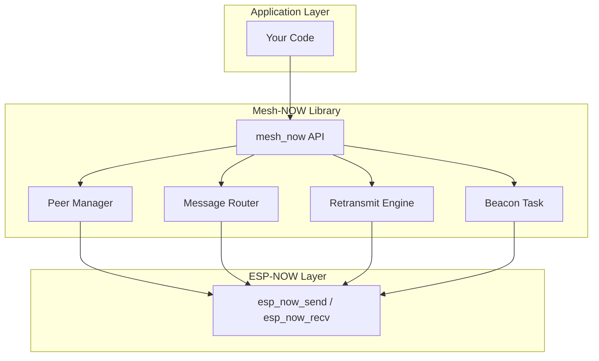

Mesh-NOW is a protocol library that turns any ESP32 into a mesh networking node using ESP-NOW as the transport layer.

## Architecture

## Node Roles

Every node runs the same code. There are no special roles -- every node can:

- **Discover peers** via periodic beacon broadcasts
- **Send messages** (broadcast, direct, or group)
- **Route messages** for other nodes (multi-hop relay)
- **Acknowledge messages** and retransmit on failure

## Message Flow

1. **Application calls** `mesh_now_send_broadcast()` or `mesh_now_send_direct()`
2. **Library assigns** a unique message ID, sets TTL, stamps the timestamp
3. **Library encrypts** the payload if an encryption key is set
4. **Library sends** via `esp_now_send()` to the broadcast MAC
5. **Receiving nodes** check for duplicates, decrypt if needed, invoke the callback
6. **Relay nodes** decrement hop count and re-broadcast if TTL > 0
7. **Direct messages** trigger an ACK, which propagates back to the sender

## FreeRTOS Tasks

Mesh-NOW creates two pinned tasks on core 0:

| Task | Stack | Priority | Purpose |
| :--- | :---- | :------- | :------ |
| `beacon_task` | 8192 bytes | 5 | Broadcasts discovery beacons every 5 seconds |
| `retransmit_task` | 8192 bytes | 5 | Retransmits pending messages every 500ms |

::: callout warning title:"Core Affinity"
Both tasks are pinned to core 0. If your application uses core 0 heavily, adjust the task priorities or core affinity in `mesh_now.c`.
::: /callout

## Memory Footprint

| Component | RAM |
| :-------- | :-- |
| Peer table (20 peers) | ~640 bytes |
| Pending messages (16 slots) | ~4.6 KB |
| Seen message IDs (128 entries) | ~512 bytes |
| Beacon task stack | 8192 bytes |
| Retransmit task stack | 8192 bytes |
| **Total library overhead** | **~14 KB** |

## Next Steps

::: grids
::: grid
::: button "Message Format" ../guide/message-format.md icon:file-text
::: /grid

::: grid
::: button "Peer Discovery" ../guide/peer-discovery.md icon:search
::: /grid

::: grid
::: button "API Reference" ../api/ icon:code
::: /grid
::: /grids
