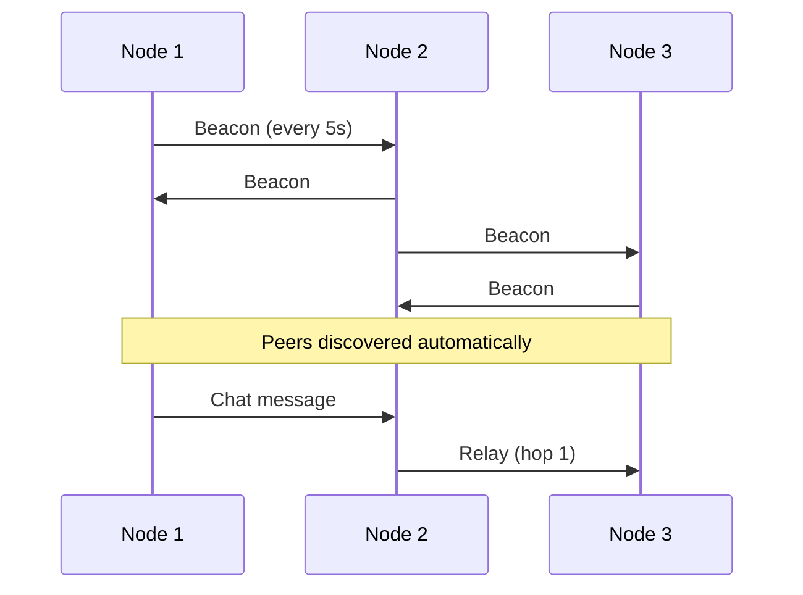

Get a Mesh-NOW node running on your ESP32 in under 10 minutes.

::: callout tip title:"Prerequisites"
- ESP32 development board (any variant)
- ESP-IDF v5.5.1+ installed and sourced
- USB cable
::: /callout

::: steps

1. **Clone and enter the repository**

   ```bash
   git clone https://github.com/NellowTCS/Mesh-NOW.git
   cd Mesh-NOW
   ```

2. **Enter the firmware project**

   The reference chat firmware lives in `Firmware/`:

   ```bash
   cd Mesh-NOW/Firmware
   ```

3. **Set your target**

   ```bash
   idf.py set-target esp32
   ```

   Replace `esp32` with your board's target: `esp32s2`, `esp32s3`, `esp32c3`, or `esp32c6`.

4. **Build**

   The mesh library lives in `Build/` at the repository root and is pulled in
   automatically via `EXTRA_COMPONENT_DIRS` in `Firmware/CMakeLists.txt`.

   ```bash
   idf.py build
   ```

5. **Flash and monitor**

   ```bash
   idf.py -p /dev/ttyUSB0 flash monitor
   ```

   Replace `/dev/ttyUSB0` with your serial port. On macOS it is typically `/dev/cu.usbserial-*`.

6. **Connect and chat**

   - Wait for the node to boot (you will see `ESP-NOW mesh networking initialized successfully` in the log)
   - Connect to the WiFi network `MESH-NOW-XXXXXXXX` (password: `password`)
   - Open `http://192.168.4.1` in a browser

::: /steps

## Multiple Nodes

Flash two or more ESP32 boards. Power them on and they will automatically discover each other via beacons. Messages sent from any node propagate through the mesh.



## Next Steps

::: grids
::: grid
::: button "Installation" ./installation.md icon:download
::: /grid

::: grid
::: button "Core Concepts" ./concepts.md icon:book
::: /grid

::: grid
::: button "API Reference" ../api/ icon:code
::: /grid
::: /grids
