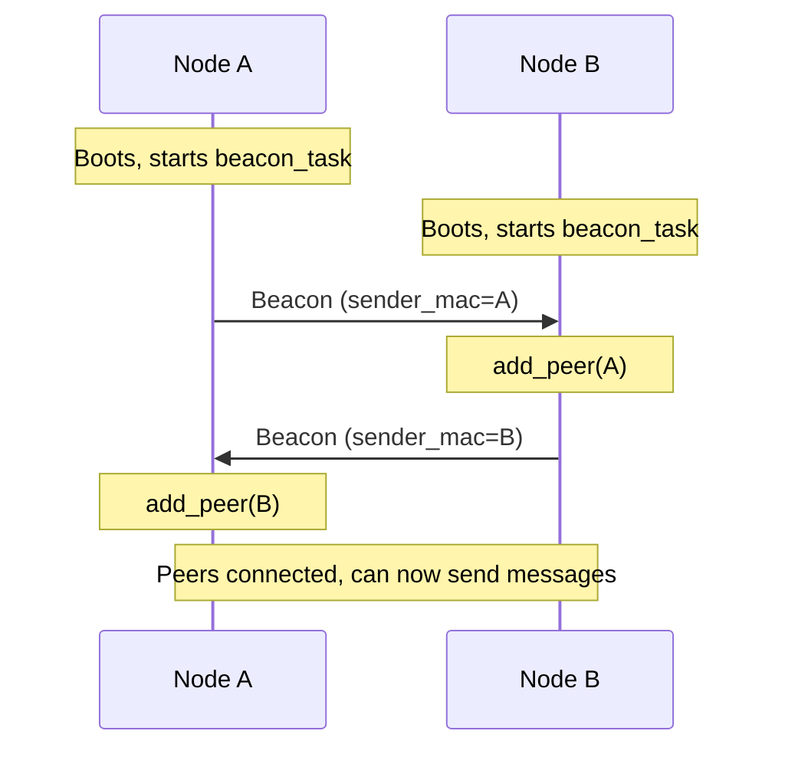

Mesh-NOW uses periodic beacon broadcasts for automatic peer discovery. No manual peer configuration is required.

## Beacon Mechanism

Every node runs a `beacon_task` that broadcasts a `MSG_TYPE_BEACON` message every 5 seconds. Each beacon carries the sender's node name plus a zone announce: up to `CONFIG_MESH_NOW_MAX_BEACON_NEIGHBORS` of the sender's one-hop peers, so two-hop nodes learn virtual-peer routes proactively. The announce is trimmed to the densest set that fits the 250-byte ESP-NOW frame cap (shortest names first), so a full neighbor set never overflows a frame.

```c
// Simplified beacon construction
mesh_message_t beacon = {0};
beacon.type = MSG_TYPE_BEACON;
beacon.flags |= MSG_FLAG_HAS_NODE_NAME;
strncpy(beacon.node_name, "Sensor-01", MESH_NOW_NODE_NAME_MAX);
// The beacon task fills in neighbor_macs[]/neighbor_names[] from the
// active peer table, then encodes and broadcasts the frame.
```

When a node receives a beacon, it adds the sender to its peer table:

```c
if (mesh_msg.type == MSG_TYPE_BEACON) {
    mesh_now_add_peer(mesh_msg.sender_mac);
}
```

## Peer Table

The peer table is a fixed-size array of `mesh_peer_t` entries:

```c
typedef struct {
    uint8_t peer_addr[6];  // MAC address
    bool active;           // Whether this peer is valid
    int64_t last_seen;     // Monotonic us of last contact
    char node_name[17];    // Human-readable name (from beacons)
} mesh_peer_t;

#define MAX_PEERS 20
```

### Managing Peers

```c
// Add a peer (called automatically on beacon/chat receipt)
mesh_now_add_peer(const uint8_t *mac);

// Remove a peer
mesh_now_remove_peer(const uint8_t *mac);

// Get current peer count
int mesh_now_get_peer_count(void);

// Get pointer to peer table (not thread-safe, internal state)
mesh_peer_t* mesh_now_get_peers(void);

// Thread-safe copy of the peer table
int mesh_now_snapshot_peers(mesh_peer_t *out, size_t max_out);
```

::: callout warning title:"Self-Exclusion"
`mesh_now_add_peer()` automatically ignores your own MAC address. You cannot accidentally add yourself as a peer.
::: /callout

## Discovery Flow



## Peer Expiration

Each peer records `last_seen` (monotonic us) whenever it is contacted. The `beacon_task` periodically expels peers that have not been seen within `PEER_EXPIRY_US` (default 30 seconds, configurable via the `MESH_NOW_PEER_EXPIRY_SEC` Kconfig option). Expired peers are removed from the active table, and the table compacts so `peer_count` reflects only active peers.

```c
// Expired when no beacon/message received within the window:
(now - peers[i].last_seen) > PEER_EXPIRY_US
```

::: callout info title:"Expiry vs. Removal"
Expiry drops a peer from the active table, compacts it out, and calls `esp_now_del_peer()` to free the ESP-NOW registration slot. If the same node contacts the mesh again, `mesh_now_add_peer()` reactivates the entry (re-registering it) and refreshes `last_seen`. Because expired entries are compacted out, `mesh_now_get_peer_count()` and `mesh_now_snapshot_peers()` report only online-tracking entries and the table cannot be starved by dead peers.
::: /callout

## Peer Events

Peers are also discovered (and added) when receiving any of these message types:

| Message Type | Peer Added? |
| :----------- | :---------- |
| `MSG_TYPE_BEACON` | Yes |
| `MSG_TYPE_CHAT` | Yes |
| `MSG_TYPE_DIRECT` | Yes (target only) |
| `MSG_TYPE_GROUP` | Yes |
| `MSG_TYPE_PRESENCE` | Yes |
| `MSG_TYPE_TYPING` | No (routed, not added) |
| `MSG_TYPE_ACK` | No |

## Next Steps

::: grids
::: grid
::: button "Message Format" ./message-format.md icon:file-text
::: /grid

::: grid
::: button "Routing" ./routing.md icon:radio
::: /grid

::: grid
::: button "Configuration" ./configuration.md icon:settings
::: /grid
::: /grids
