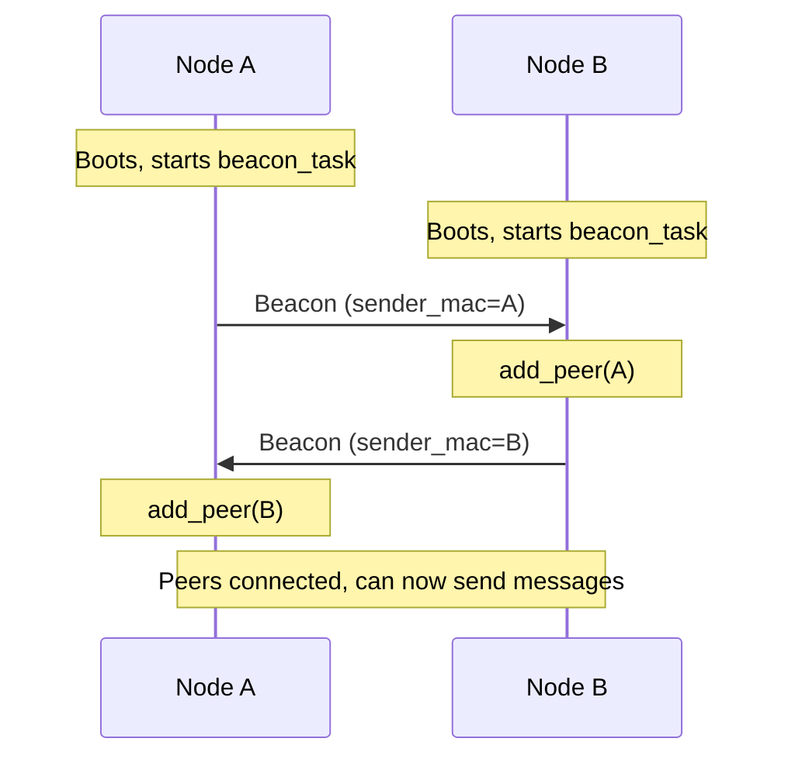

Mesh-NOW uses periodic beacon broadcasts for automatic peer discovery. No manual peer configuration is required.

## Beacon Mechanism

Every node runs a `beacon_task` that broadcasts a `MSG_TYPE_BEACON` message every 5 seconds:

```c
// Simplified beacon task
while (1) {
    mesh_message_t beacon = {0};
    beacon.type = MSG_TYPE_BEACON;
    esp_read_mac(beacon.sender_mac, ESP_MAC_WIFI_STA);
    beacon.timestamp = esp_timer_get_time() / 1000;
    strcpy(beacon.message, "MESH-NOW-BEACON");

    esp_now_send(broadcast_mac, &beacon, sizeof(mesh_message_t));
    vTaskDelay(pdMS_TO_TICKS(5000));
}
```

When a node receives a beacon, it adds the sender to its peer table:

```c
if (mesh_msg.type == MSG_TYPE_BEACON) {
    mesh_now_add_peer(mesh_msg.sender_mac);
}
```

## Peer Table

The peer table is a fixed-size array of `mesh_peer_t` entries:

```c
typedef struct {
    uint8_t peer_addr[6];  // MAC address
    bool active;           // Whether this peer is valid
    int64_t last_seen;     // Monotonic ms of last contact
    char node_name[17];    // Human-readable name (from beacons)
} mesh_peer_t;

#define MAX_PEERS 20
```

### Managing Peers

```c
// Add a peer (called automatically on beacon/chat receipt)
mesh_now_add_peer(const uint8_t *mac);

// Remove a peer
mesh_now_remove_peer(const uint8_t *mac);

// Get current peer count
int mesh_now_get_peer_count(void);

// Get pointer to peer table (not thread-safe, internal state)
mesh_peer_t* mesh_now_get_peers(void);

// Thread-safe copy of the peer table
int mesh_now_snapshot_peers(mesh_peer_t *out, size_t max_out);
```

::: callout warning title:"Self-Exclusion"
`mesh_now_add_peer()` automatically ignores your own MAC address. You cannot accidentally add yourself as a peer.
::: /callout

## Discovery Flow



## Peer Expiration

Each peer records `last_seen` (monotonic ms) whenever it is contacted. The `beacon_task` periodically marks peers inactive once they have not been seen within `PEER_EXPIRY_US` (default 30 seconds, configurable via the `MESH_NOW_PEER_EXPIRY_SEC` Kconfig option). Expired peers remain in the table but report `online == false`.

```c
// Expired when no beacon/message received within the window:
(now - peers[i].last_seen) > PEER_EXPIRY_US
```

::: callout info title:"Expiry vs. Removal"
Expiry only flips a peer to inactive; it does not free the slot. A peer is fully removed from the ESP-NOW subsystem and the local table only via `mesh_now_remove_peer()` or on reboot.
::: /callout

## Peer Events

Peers are also discovered (and added) when receiving any of these message types:

| Message Type | Peer Added? |
| :----------- | :---------- |
| `MSG_TYPE_BEACON` | Yes |
| `MSG_TYPE_CHAT` | Yes |
| `MSG_TYPE_DIRECT` | Yes (target only) |
| `MSG_TYPE_GROUP` | Yes |
| `MSG_TYPE_PRESENCE` | Yes |
| `MSG_TYPE_TYPING` | No (routed, not added) |
| `MSG_TYPE_ACK` | No |

## Next Steps

::: grids
::: grid
::: button "Message Format" ./message-format.md icon:file-text
::: /grid

::: grid
::: button "Routing" ./routing.md icon:radio
::: /grid

::: grid
::: button "Configuration" ./configuration.md icon:settings
::: /grid
::: /grids
