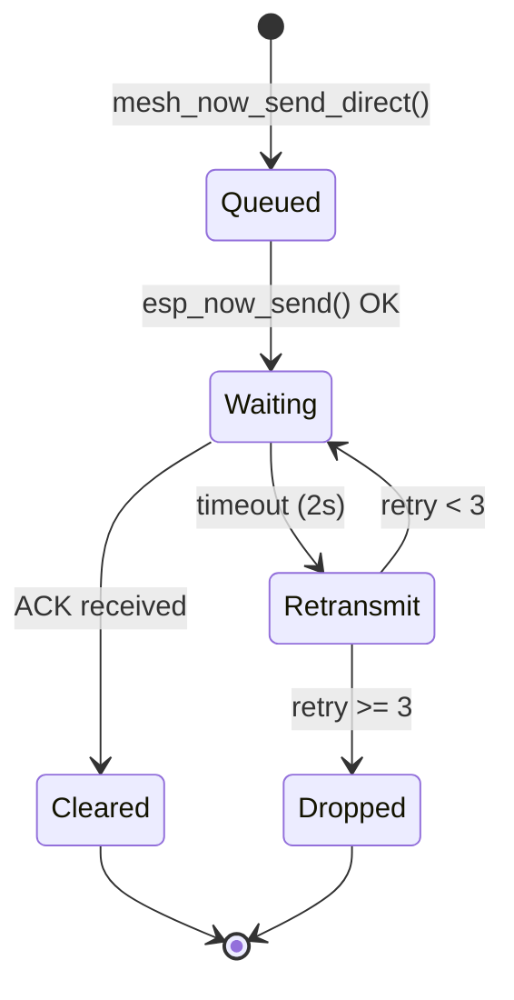

Mesh-NOW provides reliable delivery for direct messages via an ACK/retransmit system.

## ACK Mechanism

When a node receives a `MSG_TYPE_DIRECT` message addressed to it, it sends an ACK:

```c
static void mesh_now_send_ack(const mesh_message_t *received_msg)
{
    mesh_message_t ack_msg = {0};
    ack_msg.type = MSG_TYPE_ACK;
    // Give the ACK its own fresh id so it can participate in seen-message dedup
    ack_msg.message_id = mesh_now_generate_message_id();
    ack_msg.reply_to = received_msg->message_id;
    ack_msg.hop_limit = DEFAULT_ROUTE_TTL;  // hop_count starts at 0
    esp_read_mac(ack_msg.sender_mac, ESP_MAC_WIFI_STA);
    memcpy(ack_msg.target_mac, received_msg->sender_mac, ESP_NOW_ETH_ALEN);

    uint8_t wire[WIRE_BUF_SIZE];
    size_t wire_len = 0;
    if (mesh_now_prepare_wire(&ack_msg, wire, &wire_len, false) != ESP_OK) {
        return;
    }

    // Unicast back to the originator; broadcast ACKs waste airtime and get
    // lost under load, causing false retransmit drops on the sender.
    esp_now_send(received_msg->sender_mac, wire, wire_len);
}
```

The ACK's `reply_to` identifies the message being acknowledged while `message_id` carries a fresh value, so routed ACKs are not re-flooded by every relay's seen-message dedup. The ACK propagates back to the original sender, where it clears the pending message slot.

## Retransmission

The `retransmit_task` polls the pending table and resends timed-out messages:

```c
static void retransmit_task(void *pvParameters)
{
    while (1) {
        int64_t now_ms = esp_timer_get_time() / 1000;
        xSemaphoreTake(state_mutex, portMAX_DELAY);

        for (int i = 0; i < MAX_PENDING_MESSAGES; ++i) {
            pending_message_t *pending = &pending_messages[i];
            if (!pending->active) continue;

            if (!(pending->flags & MSG_FLAG_REQUIRES_ACK)) {
                pending->active = false;
                continue;
            }

            // Skip if not yet timed out
            if (now_ms - pending->last_send_time_ms < RETRANSMIT_TIMEOUT_MS)
                continue;

            // Drop after max retries
            if (pending->retries >= MAX_RETRIES) {
                pending->active = false;
                continue;
            }

            pending->retries++;
            pending->last_send_time_ms = now_ms;
            esp_now_send(pending->dest_mac, pending->wire_buf,
                         pending->wire_len);
        }

        xSemaphoreGive(state_mutex);
        vTaskDelay(pdMS_TO_TICKS(500));
    }
}
```

## Pending Message Table

Unacknowledged messages are tracked in a fixed-size table. Each slot stores the pre-serialized wire buffer (not a `mesh_message_t`) so retransmits avoid re-encoding:

```c
typedef struct {
    bool active;
    uint32_t message_id;
    uint8_t flags;
    uint8_t wire_buf[WIRE_BUF_SIZE];  // serialized frame to resend
    size_t wire_len;
    uint8_t dest_mac[6];              // next hop to send to
    uint8_t remote_dest[6];           // final destination (routed DMs)
    bool route_wait;                  // waiting for a route to remote_dest
    int retries;
    int64_t last_send_time_ms;
} pending_message_t;

#define MAX_PENDING_MESSAGES 16
```

The table is protected by the internal `state_mutex`, so the retransmit task and the sending path never observe a partially-initialized entry.

### Lifecycle



## Parameters

| Parameter | Default | Description |
| :-------- | :------ | :---------- |
| `RETRANSMIT_TIMEOUT_MS` | 2000ms | Time before retransmit attempt |
| `MAX_RETRIES` | 3 | Maximum retransmission attempts |
| `MAX_PENDING_MESSAGES` | 16 | Slots in the pending message table |

## Which Messages Use ACK

| Message Type | ACK Required | Retransmit |
| :----------- | :----------- | :--------- |
| `MSG_TYPE_CHAT` | No | No |
| `MSG_TYPE_DIRECT` | Yes | Yes |
| `MSG_TYPE_GROUP` | No | No |
| `MSG_TYPE_PRESENCE` | No | No |
| `MSG_TYPE_TYPING` | No | No |
| `MSG_TYPE_BEACON` | No | No |

::: callout info title:"Broadcast Messages"
Chat, group, presence, and typing messages are fire-and-forget. They rely on the mesh's broadcast nature for delivery rather than individual ACKs. This keeps broadcast overhead low.
::: /callout

## ACK Routing

ACKs are relayed through the mesh in the same way as other direct traffic. An intermediate node that is not the ACK target forwards it one hop toward the target; the ACK recipient clears its pending slot:

```c
if (mesh_msg.type == MSG_TYPE_ACK) {
    if (memcmp(mesh_msg.target_mac, my_mac, ESP_NOW_ETH_ALEN) != 0) {
        // Not for us: forward one hop toward the ACK target.
        forward_directed(&mesh_msg, mesh_msg.target_mac);
        return;
    }

    // For us: clear the pending DM this ACK acknowledges.
    int idx = mesh_now_find_pending(mesh_msg.reply_to);
    if (idx >= 0) {
        mesh_now_release_pending(idx);
    }
}
```

## Next Steps

::: grids
::: grid
::: button "Routing" ./routing.md icon:radio
::: /grid

::: grid
::: button "Configuration" ./configuration.md icon:settings
::: /grid

::: grid
::: button "State Machine" ../protocol/state-machine.md icon:cpu
::: /grid
::: /grids
