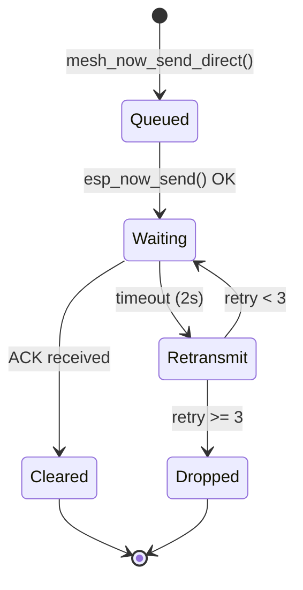

Mesh-NOW provides reliable delivery for direct messages via an ACK/retransmit system.

## ACK Mechanism

When a node receives a `MSG_TYPE_DIRECT` message addressed to it, it sends an ACK:

```c
static void mesh_now_send_ack(const mesh_message_t *received_msg)
{
    mesh_message_t ack_msg = {0};
    ack_msg.type = MSG_TYPE_ACK;
    ack_msg.message_id = received_msg->message_id;
    ack_msg.hop_count = DEFAULT_ROUTE_TTL;
    esp_read_mac(ack_msg.sender_mac, ESP_MAC_WIFI_STA);
    memcpy(ack_msg.target_mac, received_msg->sender_mac, ESP_NOW_ETH_ALEN);

    esp_now_send(broadcast_mac, &ack_msg, sizeof(mesh_message_t));
}
```

The ACK propagates through the mesh back to the original sender, where it clears the pending message slot.

## Retransmission

The `retransmit_task` runs every 500ms and checks for unacknowledged messages:

```c
static void retransmit_task(void *pvParameters)
{
    while (1) {
        int64_t now_ms = esp_timer_get_time() / 1000;

        for (int i = 0; i < MAX_PENDING_MESSAGES; ++i) {
            pending_message_t *pending = &pending_messages[i];
            if (!pending->active) continue;

            // Skip if not yet timed out
            if (now_ms - pending->last_send_time_ms < RETRANSMIT_TIMEOUT_MS)
                continue;

            // Drop after max retries
            if (pending->retries >= 3) {
                pending->active = false;
                continue;
            }

            pending->retries++;
            pending->last_send_time_ms = now_ms;
            esp_now_send(pending->dest_mac, &pending->msg, sizeof(mesh_message_t));
        }

        vTaskDelay(pdMS_TO_TICKS(500));
    }
}
```

## Pending Message Table

Unacknowledged messages are tracked in a fixed-size table:

```c
typedef struct {
    bool active;
    mesh_message_t msg;
    uint8_t dest_mac[6];
    int retries;
    int64_t last_send_time_ms;
} pending_message_t;

#define MAX_PENDING_MESSAGES 16
```

### Lifecycle



## Parameters

| Parameter | Default | Description |
| :-------- | :------ | :---------- |
| `RETRANSMIT_TIMEOUT_MS` | 2000ms | Time before retransmit attempt |
| `MAX_RETRIES` | 3 | Maximum retransmission attempts |
| `MAX_PENDING_MESSAGES` | 16 | Slots in the pending message table |

## Which Messages Use ACK

| Message Type | ACK Required | Retransmit |
| :----------- | :----------- | :--------- |
| `MSG_TYPE_CHAT` | No | No |
| `MSG_TYPE_DIRECT` | Yes | Yes |
| `MSG_TYPE_GROUP` | No | No |
| `MSG_TYPE_PRESENCE` | No | No |
| `MSG_TYPE_TYPING` | No | No |
| `MSG_TYPE_BEACON` | No | No |

::: callout info title:"Broadcast Messages"
Chat, group, presence, and typing messages are fire-and-forget. They rely on the mesh's broadcast nature for delivery rather than individual ACKs. This keeps broadcast overhead low.
::: /callout

## ACK Routing

ACKs are relayed through the mesh just like other messages. An intermediate node that is not the ACK target will forward it:

```c
if (mesh_msg.type == MSG_TYPE_ACK) {
    if (memcmp(mesh_msg.target_mac, my_mac, ESP_NOW_ETH_ALEN) != 0) {
        // Not for us, relay it
        mesh_now_route_message(&mesh_msg);
        return;
    }

    // For us -- clear the pending message
    int pending_index = mesh_now_find_pending(mesh_msg.message_id);
    if (pending_index >= 0) {
        mesh_now_release_pending(pending_index);
    }
}
```

## Next Steps

::: grids
::: grid
::: button "Routing" ./routing.md icon:radio
::: /grid

::: grid
::: button "Configuration" ./configuration.md icon:settings
::: /grid

::: grid
::: button "State Machine" ../protocol/state-machine.md icon:cpu
::: /grid
::: /grids
