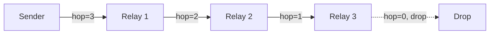

Mesh-NOW routes messages through intermediate nodes using a hop-count TTL mechanism.

## How Routing Works

When a node receives a message not addressed to it, it decrements the hop count and re-broadcasts:

```c
static void mesh_now_route_message(mesh_message_t *msg)
{
    if (msg->hop_count == 0) {
        return;  // TTL expired
    }

    mesh_message_t forward = *msg;
    forward.hop_count--;

    if (forward.hop_count == 0) {
        return;  // Would be 0 after decrement, drop
    }

    esp_now_send(broadcast_mac, &forward, sizeof(mesh_message_t));
}
```

## TTL (Time to Live)

The default TTL is 3 hops:

```c
#define DEFAULT_ROUTE_TTL 3
```

This means a message can traverse up to 3 intermediate nodes before being dropped. The hop count is set when the message is sent and decremented at each relay.



## Duplicate Detection

Each node maintains a ring buffer of 128 recently seen message IDs:

```c
#define MAX_SEEN_MESSAGE_IDS 128

static uint32_t seen_message_ids[MAX_SEEN_MESSAGE_IDS];
static int seen_message_count = 0;
```

When a message arrives:

1. If it is a **beacon** or **ACK**, skip duplicate check (beacons are discovery, ACKs are delivery confirmation)
2. Check if `message_id` is in the seen buffer
3. If seen, drop the message
4. If new, add to the buffer and process

```c
if (mesh_msg.type != MSG_TYPE_BEACON && mesh_msg.type != MSG_TYPE_ACK) {
    if (mesh_now_is_message_seen(mesh_msg.message_id)) {
        return;  // Duplicate, drop
    }
    mesh_now_mark_message_seen(mesh_msg.message_id);
}
```

::: callout info title:"Ring Buffer Behavior"
When the seen buffer is full, the oldest entry is shifted out and the new ID is appended. This is a FIFO eviction policy.
::: /callout

## Which Messages Relay

| Message Type | Relayed? | Condition |
| :----------- | :------- | :-------- |
| `MSG_TYPE_BEACON` | No | Discovery only, not relayed |
| `MSG_TYPE_CHAT` | Yes | Always relayed if hop_count > 0 |
| `MSG_TYPE_DIRECT` | Yes | Relayed if target MAC != self |
| `MSG_TYPE_ACK` | Yes | Relayed if target MAC != self |
| `MSG_TYPE_GROUP` | Yes | Always relayed if hop_count > 0 |
| `MSG_TYPE_PRESENCE` | Yes | Always relayed if hop_count > 0 |
| `MSG_TYPE_TYPING` | Yes | Relayed if target MAC != self |

## Retransmission vs. Relay

Retransmission and relay are different mechanisms:

- **Retransmission** is for the original sender to retry delivery of unacknowledged direct messages (up to 3 retries, 2-second timeout)
- **Relay** is for intermediate nodes to forward messages through the mesh (decrement hop count, re-broadcast)

::: grids
::: grid
::: button "Reliability" ./reliability.md icon:refresh-cw
::: /grid

::: grid
::: button "Message Format" ./message-format.md icon:file-text
::: /grid

::: grid
::: button "Wire Format" ../protocol/wire-format.md icon:file-code
::: /grid
::: /grids
