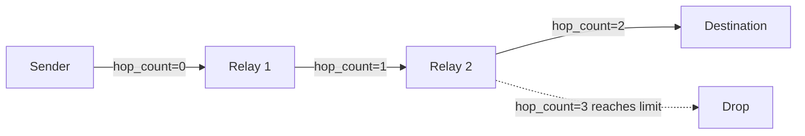

Mesh-NOW routes messages through intermediate nodes using a hop-count TTL mechanism.

## How Routing Works

When a node receives a broadcast data frame, it relays it while the hop budget remains:

```c
static void maybe_relay(const mesh_message_t *mesh_msg)
{
    if (mesh_now_can_relay(mesh_msg)) {
        mesh_now_relay_broadcast(mesh_msg, true);
    }
}
```

`mesh_now_can_relay()` checks that `hop_count` is still below `hop_limit`; `mesh_now_relay_broadcast()` increments `hop_count` and re-broadcasts. Direct frames (DM, ACK, typing) instead forward one hop toward their target: along a route when one is known, otherwise as a bounded flood.

## TTL (Time to Live)

The default hop limit is 3:

```c
#define DEFAULT_ROUTE_TTL 3
```

A frame originates with `hop_count = 0` and is relayed while `hop_count` stays below `hop_limit`. A limit of 3 therefore means up to 2 intermediate relays before the frame is dropped.



## Duplicate Detection

Each node maintains a ring buffer of 128 recently seen message IDs:

```c
#define MAX_SEEN_MESSAGE_IDS 128

static uint32_t seen_message_ids[MAX_SEEN_MESSAGE_IDS];
static int seen_message_count = 0;
```

When a message arrives:

1. If it is a control frame (beacon, ACK, RREQ, RREP, RERR), skip the duplicate check (control frames are short-lived and self-deduplicating)
2. Check if `message_id` is in the seen buffer
3. If seen, drop the message
4. If new, add to the buffer and process

```c
if (!mesh_now_is_control_type(mesh_msg.type)) {
    if (mesh_now_is_message_seen(mesh_msg.message_id)) {
        return;  // Duplicate, drop
    }
    mesh_now_mark_message_seen(mesh_msg.message_id);
}
```

::: callout info title:"Ring Buffer Behavior"
When the seen buffer is full, the oldest entry is shifted out and the new ID is appended. This is a FIFO eviction policy.
::: /callout

## Which Messages Relay

| Message Type | Relayed? | Condition |
| :----------- | :------- | :-------- |
| `MSG_TYPE_BEACON` | No | Discovery only, handled locally |
| `MSG_TYPE_CHAT` | Yes | Broadcast while hop budget remains |
| `MSG_TYPE_DIRECT` | Yes | Forwarded toward target via route, or flooded if no route |
| `MSG_TYPE_ACK` | Yes | Forwarded toward target along the return path |
| `MSG_TYPE_GROUP` | Yes | Relayed regardless of group membership |
| `MSG_TYPE_PRESENCE` | Yes | Broadcast while hop budget remains |
| `MSG_TYPE_TYPING` | Yes | Forwarded toward target like a direct frame |
| RREQ / RREP / RERR | No | Consumed by the discovery layer |

## Retransmission vs. Relay

Retransmission and relay are different mechanisms:

- **Retransmission** is for the original sender to retry delivery of unacknowledged direct messages (up to 3 retries, 2-second timeout)
- **Relay** is for intermediate nodes to forward messages through the mesh (increment hop count, forward toward target or flood)

::: grids
::: grid
::: button "Reliability" ./reliability.md icon:refresh-cw
::: /grid

::: grid
::: button "Message Format" ./message-format.md icon:file-text
::: /grid

::: grid
::: button "Wire Format" ../protocol/wire-format.md icon:file-code
::: /grid
::: /grids
