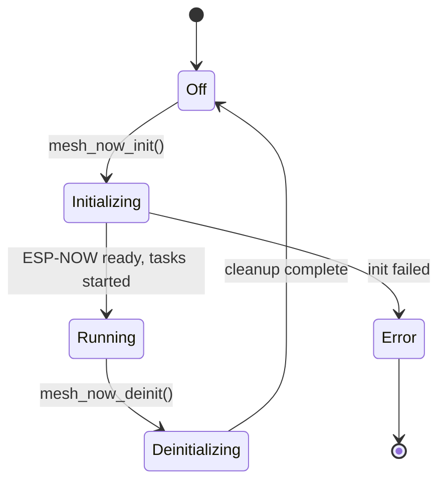
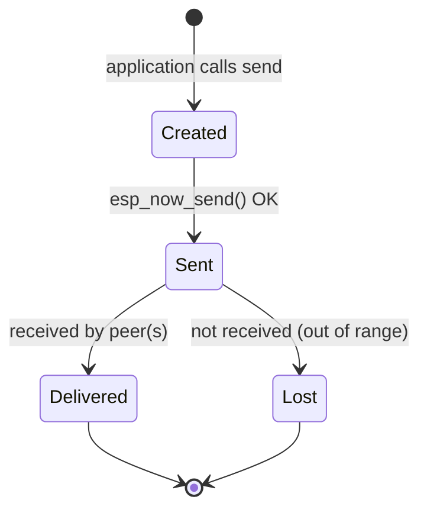
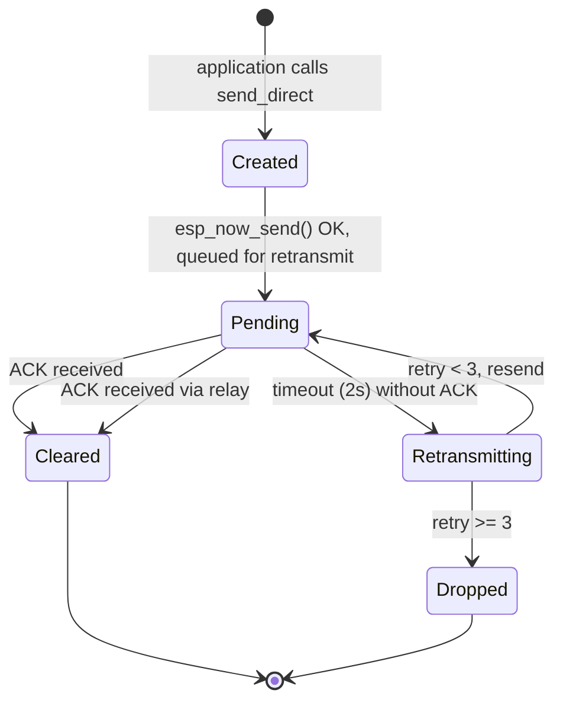
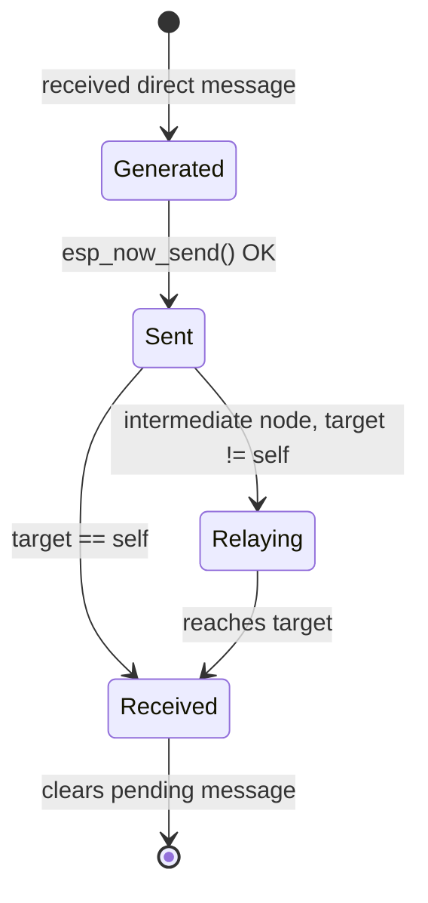
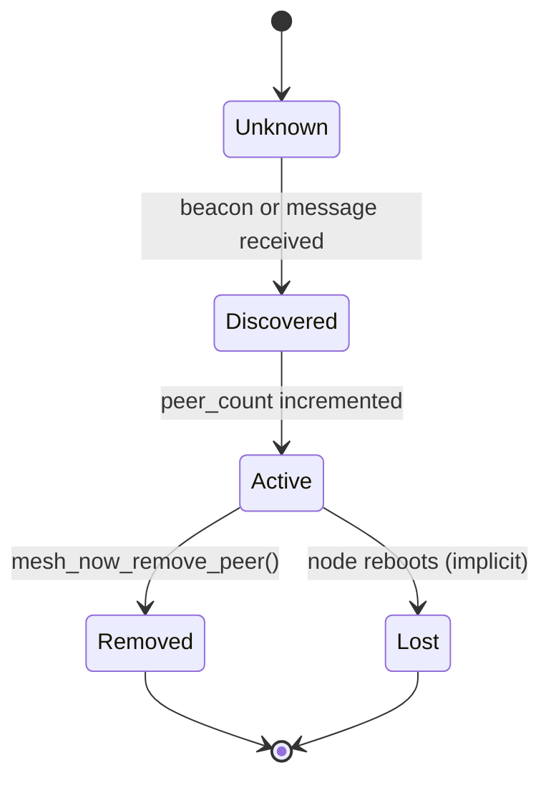
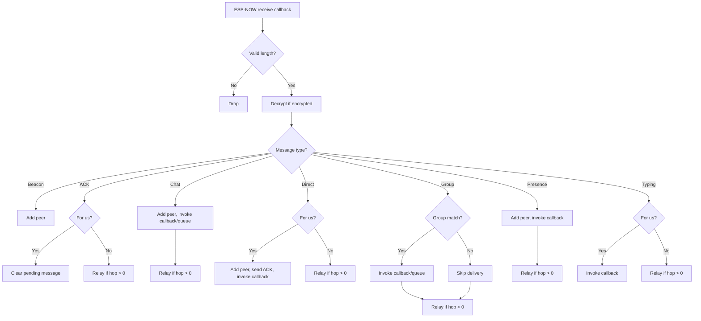

Mesh-NOW's behavior can be modeled as a set of interacting state machines.

## Node Lifecycle

### States

| State | Description |
| :---- | :---------- |
| **Off** | No mesh activity. ESP-NOW not initialized. |
| **Initializing** | `mesh_now_init()` executing. Registering callbacks, adding broadcast peer, creating tasks. |
| **Running** | Normal operation. Beacon task broadcasting, retransmit task polling, receive callback registered. |
| **Error** | Initialization failed (ESP-NOW init, callback registration, or task creation). |
| **Deinitializing** | `mesh_now_deinit()` executing. Deleting tasks, removing peers, unregistering callbacks. |

## Message State Machine

### Broadcast Message (Chat, Group, Presence)

### Direct Message (with ACK)

### ACK Message

## Peer States

### Peer Lifecycle

| Transition | Trigger | Action |
| :--------- | :------ | :----- |
| Unknown -> Discovered | Beacon or message received from MAC | `mesh_now_add_peer()` called |
| Discovered -> Active | MAC not in peer table, not self, not duplicate | Added to ESP-NOW subsystem and local table |
| Active -> Removed | `mesh_now_remove_peer()` called | Removed from ESP-NOW subsystem and local table |
| Active -> Lost | Node reboots | Peer table cleared on boot |

## Message Processing Flow

## Timing Constants

| Event | Interval | State Impact |
| :---- | :------- | :----------- |
| Beacon broadcast | Every 5000ms | Triggers peer discovery at receivers |
| Retransmit poll | Every 500ms | Checks pending messages for timeout |
| Retransmit timeout | 2000ms | Moves pending message to retransmit state |
| Max retries | 3 | Drops message after 3 failed retransmits |

## Next Steps

::: grids
::: grid
::: button "Wire Format" ./wire-format.md icon:file-code
::: /grid

::: grid
::: button "Routing" ../guide/routing.md icon:radio
::: /grid

::: grid
::: button "Reliability" ../guide/reliability.md icon:refresh-cw
::: /grid
::: /grids
