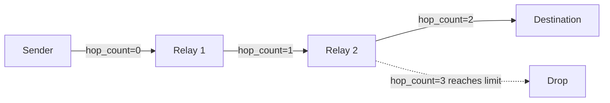

---
title: "Routing"
description: "Multi-hop message relay, TTL, and duplicate detection."
---

Mesh-NOW routes messages through intermediate nodes with a hop-count limit mechanism.

## How Routing Works

When a node receives a broadcast data frame, it relays it while the hop budget remains:

```c
static void maybe_relay(const mesh_message_t *mesh_msg)
{
    if (mesh_now_can_relay(mesh_msg)) {
        mesh_now_relay_broadcast(mesh_msg, true);
    }
}
```

`mesh_now_can_relay()` checks that `hop_count` is still below `hop_limit`. `mesh_now_relay_broadcast()` increments `hop_count` and re-broadcasts. Direct frames (DM, ACK, typing) take a different path: they forward one hop toward their target, along a route when one is known, otherwise as a bounded flood.

## Hop Limit

The default hop limit is 3, pulled from Kconfig:

```c
#ifndef CONFIG_MESH_NOW_DEFAULT_ROUTE_TTL
#define CONFIG_MESH_NOW_DEFAULT_ROUTE_TTL 3
#endif
#define DEFAULT_ROUTE_TTL CONFIG_MESH_NOW_DEFAULT_ROUTE_TTL
```

A frame originates with `hop_count = 0` and is relayed while `hop_count` stays below `hop_limit`. A limit of 3 therefore allows up to 2 intermediate relays before the frame is dropped.



## Duplicate Detection

Each node keeps a fixed buffer of the most recent seen message IDs (128 default):

```c
#define MAX_SEEN_MESSAGE_IDS CONFIG_MESH_NOW_MAX_SEEN_MESSAGE_IDS

static uint32_t seen_message_ids[MAX_SEEN_MESSAGE_IDS];
static int seen_message_count = 0;
```

When a message arrives:

1. If it is a control frame (beacon, ACK, RREQ, RREP, RERR), skip the duplicate check. Control frames are short-lived and self-deduplicating.
2. Check if `message_id` is in the seen buffer.
3. If seen, drop the message.
4. If new, add to the buffer and process.

```c
if (!mesh_now_is_control_type(mesh_msg.type)) {
    if (mesh_now_is_message_seen(mesh_msg.message_id)) {
        return;  // duplicate, drop
    }
    mesh_now_mark_message_seen(mesh_msg.message_id);
}
```

::: callout info title:"Eviction"
When the buffer is full, the oldest entry shifts out and the new ID appends. FIFO eviction keeps the buffer bounded.
::: /callout

## Which Messages Relay

| Message Type        | Relayed? | Condition                                                    |
| ------------------- | -------- | ------------------------------------------------------------ |
| `MSG_TYPE_BEACON`   | No       | Discovery only, handled locally                              |
| `MSG_TYPE_CHAT`     | Yes      | Broadcast while hop budget remains                           |
| `MSG_TYPE_DIRECT`   | Yes      | Forwarded toward target via route, or flooded if no route    |
| `MSG_TYPE_ACK`      | Yes      | Forwarded toward target along the return path                |
| `MSG_TYPE_GROUP`    | Yes      | Relayed regardless of group membership                       |
| `MSG_TYPE_PRESENCE` | Yes      | Broadcast while hop budget remains                           |
| `MSG_TYPE_TYPING`   | Yes      | Forwarded toward target like a direct frame                  |
| RREQ / RREP / RERR  | Yes      | Relayed by the discovery layer (flood, or toward originator) |

## Retransmission vs. Relay

These are two different mechanisms:

- **Retransmission** is the original sender retrying an unacknowledged direct message (up to 3 retries on a 2-second timeout).
- **Relay** is an intermediate node forwarding a message through the mesh (increment hop count, forward toward target or flood).

::: grids
::: grid
::: button "Reliability" ./reliability.md icon:refresh-cw
::: /grid

::: grid
::: button "Message Format" ./message-format.md icon:file-text
::: /grid

::: grid
::: button "Wire Format" ../protocol/wire-format.md icon:file-code
::: /grid
::: /grids
