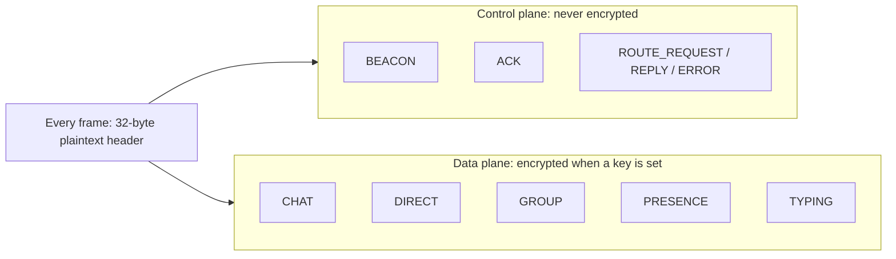

---
title: "Security"
description: "What Mesh-NOW encryption protects and what it does not."
---

Mesh-NOW encrypts the payload of data messages with AES-128-GCM once you set a key via `mesh_now_set_encryption_key()`. Control frames and every frame header stay in the clear. Encryption covers message content only; metadata, topology, and control traffic stay public.

## What gets encrypted

| Frame                    | Encrypted payload      | Because                                   |
| ------------------------ | ---------------------- | ----------------------------------------- |
| `MSG_TYPE_CHAT`          | Yes, when a key is set | User content                              |
| `MSG_TYPE_DIRECT`        | Yes, when a key is set | User content                              |
| `MSG_TYPE_GROUP`         | Yes, when a key is set | User content                              |
| `MSG_TYPE_PRESENCE`      | Yes, when a key is set | Status content                            |
| `MSG_TYPE_TYPING`        | Yes, when a key is set | Status content                            |
| `MSG_TYPE_BEACON`        | Never                  | Peer discovery must work without the key  |
| `MSG_TYPE_ACK`           | Never                  | Delivery confirmation is routing metadata |
| `MSG_TYPE_ROUTE_REQUEST` | Never                  | Routing must work without the key         |
| `MSG_TYPE_ROUTE_REPLY`   | Never                  | Routing must work without the key         |
| `MSG_TYPE_ROUTE_ERROR`   | Never                  | Routing must work without the key         |

Two functions define the split: `mesh_now_is_control_type()` identifies the control frames, and `mesh_now_prepare_wire()` encrypts everything else. A control frame is never encrypted, with or without a key. The 32-byte header is plaintext for every frame type.

## Threat model

- The attacker can hear the radio: ESP-NOW does not encrypt on its own. Frames are readable bytes on the channel, the wire format is public, and AP WiFi encryption does not apply. A second ESP32 in range, or any monitor-capable radio, is enough to capture frames.
- The attacker does not have the key: If it leaks, none of the guarantees below hold.

## What encryption does

- Confidentiality: Payloads are unreadable without the key.
- Integrity: The GCM tag authenticates the ciphertext plus the AAD: `msg_type`, `sender_mac`, `target_mac`, `group_id`, `timestamp`. A modified frame fails authentication at the receiver and is dropped. Rewriting `target_mac` to re-route a frame fails the same way. `message_id` is bound through the nonce, not the AAD.
- Sender authenticity: `sender_mac` is authenticated for encrypted frames. Without the key, a data message cannot claim to come from a specific node.

## What stays visible

Frames have no padding. An observer in radio range reads this about every frame:

| Header field                | What it reveals                                                     |
| --------------------------- | ------------------------------------------------------------------- |
| `flags`                     | That a frame is encrypted (`MSG_FLAG_ENCRYPTED` bit is visible)     |
| `sender_mac` / `target_mac` | Who talks to whom                                                   |
| `msg_type`                  | The kind of traffic                                                 |
| `group_id`                  | Group membership of a frame                                         |
| `hop_limit` / `hop_count`   | Network diameter and the path a frame takes                         |
| `message_id` / `reply_to`   | Message volume; which ACK answers which message                     |
| `timestamp`                 | Traffic timing                                                      |
| Frame length                | A proxy for payload length                                          |

Consequences:

- Traffic analysis: Addresses, types, sizes, and timing are visible on every frame. Encryption does not hide that a direct message moved from A to B, or how long it was.
- Topology: A beacon carries the node name and a zone announce of up to `CONFIG_MESH_NOW_MAX_BEACON_NEIGHBORS` peers, names included. A receiver at any link enumerates nodes and maps multi-hop topology.
- ACK spoofing: ACKs are unauthenticated and matched on `reply_to` only. A forged ACK frees the sender's pending slot, so retransmission for that message stops. The intended receiver is unaffected; the attack suppresses retries.
- Forged control frames: A forged beacon injects peers and phantom routes. A forged `ROUTE_REPLY` can pull traffic toward the attacker. Discovery and routing degrade as long as the control plane is keyless.
- Replay: The seen-message buffer holds `CONFIG_MESH_NOW_MAX_SEEN_MESSAGE_IDS` (default 128) IDs in RAM and survives a single boot. A captured frame replayed after a reboot, or after its ID ages out, still decrypts and delivers. The nonce guarantees uniqueness, not freshness.
- Key recovery: The key is one static 16 bytes in RAM. Cloning the firmware, reading provisioning flash, or capturing the device recovers it, and everything that node handled becomes readable. No forward secrecy, no per-node keys, no rotation. One compromise opens the whole mesh.
- Jamming: ESP-NOW is unauthenticated 802.11. Enough transmit power takes the channel down for everyone. No link-layer countermeasure exists.

## Why the control plane is unencrypted

- Keyless operation must work: A node boots with no key, since one is set later or never. It still has to discover the mesh, be discovered, and relay for others.
- No payload to protect: Relays route on `target_mac` and the hop fields, which are already in the header. An ACK means `reply_to` plus its target, both already public.
- Routing depends on open frames: Zone announces and the route frames are consumed by every relay. Any node routes for the mesh without holding the key.

::: callout warning title:"When the open control plane is not acceptable"
Mesh-NOW does not hide node names, topology, or delivery patterns. The data plane protects content only. Full traffic concealment needs a different link layer or a closed physical deployment.
::: /callout

## Key management

- Size: 16 bytes exactly. Use a random 128-bit key, not a passphrase.
- Distribution: Out of band: pre-provisioned firmware, physical provisioning, or an encrypted side channel. The mesh has no secure channel until a key exists.
- Storage: The library holds the key in RAM. If the app also persists it (NVS, NVS encryption, embedded image), that storage is readable from a captured device.
- Scope: One key for the whole mesh. Any node with it decrypts everything and can forge frames under any node's identity.
- Rotation: Manual, all nodes at once. After a compromise, treat pre-rotation captures as readable.

Encryption protects message content and data-frame integrity against an attacker without the key. Metadata, topology, control traffic, and the key itself are outside that scope.

## Next Steps

::: grids
::: grid
::: button "Encryption" ./encryption.md icon:lock
::: /grid

::: grid
::: button "Wire Format" ../protocol/wire-format.md icon:file-code
::: /grid

::: grid
::: button "Reliability" ./reliability.md icon:refresh-cw
::: /grid
::: /grids
