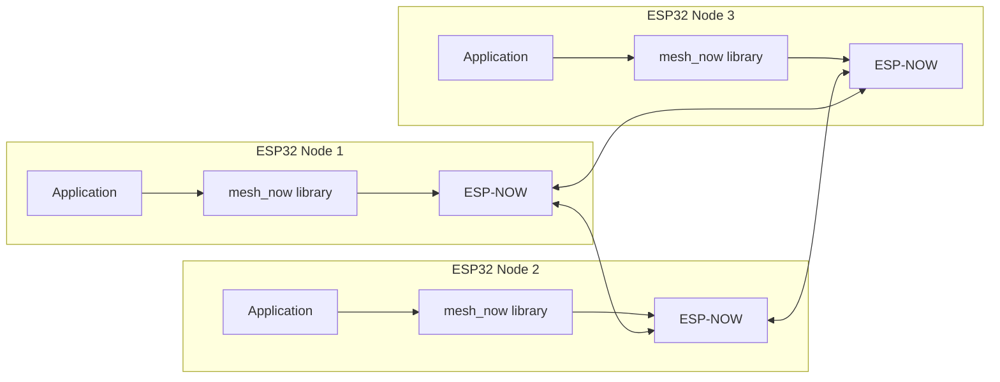

---
title: "Mesh-NOW"
description: "Lightweight mesh networking protocol for ESP32 using ESP-NOW."
---

::: hero layout:split glow:true

# Mesh-NOW

Serverless mesh networking for ESP32. Device-to-device communication over ESP-NOW with automatic peer discovery, multi-hop routing, and payload encryption.

::: tag "ESP32"
::: tag "ESP-NOW"
::: tag "Mesh Network"

::: button "Quick Start" ./getting-started/quickstart.md icon:play
::: button "GitHub" external:<https://github.com/NellowTCS/Mesh-NOW> icon:github

== side

```c
#include "mesh_now.h"

// Initialize the mesh
mesh_now_init();

// Set receive callback (before or after init)
mesh_now_set_receive_callback(on_message);

// Send a broadcast message
mesh_now_send_broadcast("Hello, mesh!");

// Enable encryption: the key must be exactly 16 bytes (AES-128)
uint8_t key[16] = {0x01, 0x02, 0x03, 0x04, 0x05, 0x06, 0x07, 0x08,
                   0x09, 0x0a, 0x0b, 0x0c, 0x0d, 0x0e, 0x0f, 0x10};
mesh_now_set_encryption_key(key, sizeof(key));
```

::: /hero

## Features

::: grids
::: grid
::: card "Serverless" icon:wifi
Direct ESP32-to-ESP32 over ESP-NOW. No router, no internet, no infrastructure.
::: /card
::: /grid
::: grid
::: card "Auto Discovery" icon:search
Nodes broadcast beacons every 5 seconds by default. Peers are discovered and tracked with no setup.
::: /card
::: /grid
::: grid
::: card "Multi-Hop Routing" icon:radio
Messages propagate through the mesh with a configurable hop limit (default 3).
::: /card
::: /grid
::: grid
::: card "Reliable Delivery" icon:refresh-cw
Direct messages get ACK-based retransmission: up to 3 retries on a 2-second timeout.
::: /card
::: /grid
::: grid
::: card "Encrypted Payloads" icon:lock
Optional AES-128-GCM payload encryption with a 16-byte key.
::: /card
::: /grid
::: grid
::: card "10 Message Types" icon:layers
Beacon, chat, direct, ACK, group, presence, typing, and the route discovery frames (request, reply, error).
::: /card
::: /grid
::: /grids

## Supported Targets

| Target   | Architecture       | RAM   | Status                            |
| -------- | ------------------ | ----- | --------------------------------- |
| ESP32    | Dual-core Xtensa   | 520KB | ::: tag "Supported" color:#22c55e |
| ESP32-S2 | Single-core Xtensa | 320KB | ::: tag "Supported" color:#22c55e |
| ESP32-S3 | Dual-core Xtensa   | 512KB | ::: tag "Supported" color:#22c55e |
| ESP32-C3 | Single-core RISC-V | 400KB | ::: tag "Supported" color:#22c55e |
| ESP32-C6 | Single-core RISC-V | 512KB | ::: tag "Supported" color:#22c55e |

## Architecture



::: grids
::: grid
::: button "Quick Start" ./getting-started/quickstart.md icon:play
::: /grid
::: grid
::: button "API Reference" ./api/ icon:code
::: /grid
::: grid
::: button "Protocol Spec" ./protocol/wire-format.md icon:file-code
::: /grid
::: /grids
